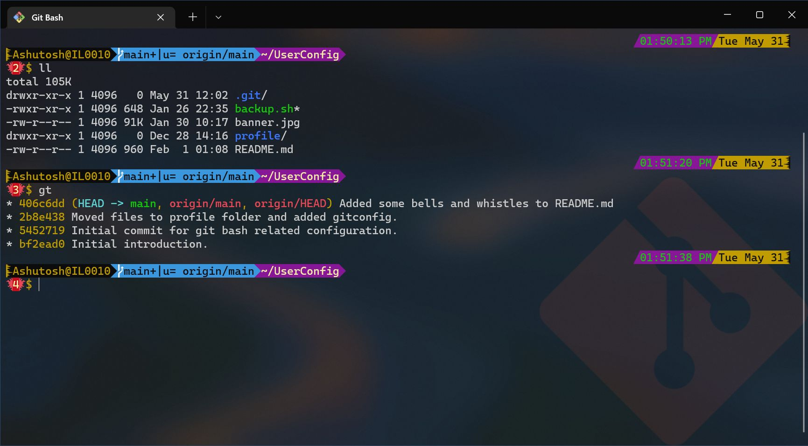

🧬 About Me
------------

- 🧠 Multiparadigm software development expert. [C++, C#, JS, Go]
- 💭 I’m interested in learning new ways to make things better, specially optimize and simplify them.
- 🌱 I’m currently learning Go programing language. But my learning style is a spiral, so many things (Ex. New versions or C++ or C#) keep revolving around.

📦 [This Repository](https://github.com/raghuwanshi/raghuwanshi "contains this README.md file.")
---------------------

If you are not reading this on my profile but in [the repository](https://github.com/raghuwanshi/raghuwanshi), then this is my home repository having a backup of my common settings and scripts that I use with Git command prompt or otherwise. 

✨ You may use them with little customization. ✨

There are many usefull features/customizations in it but the ones which are visual can be seen in this screenshot:

